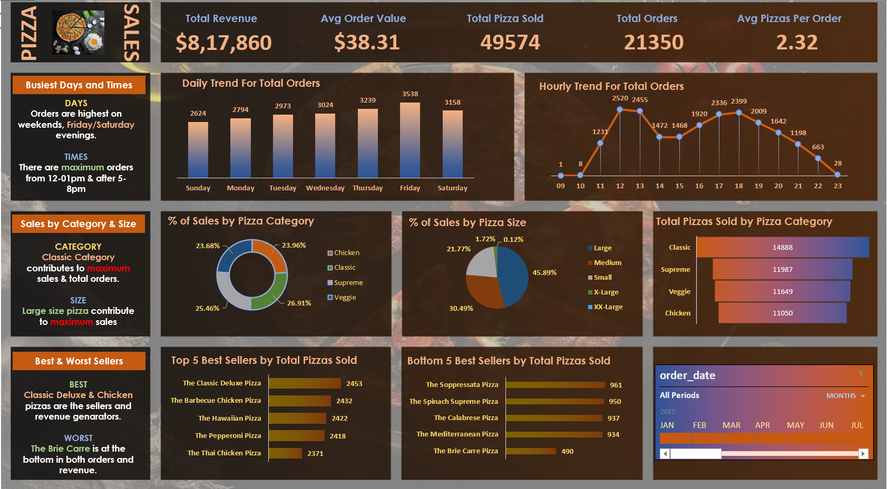

# PIZZA_SALES_DASHBOARD
# 🍕 Pizza Sales Analysis Dashboard

## 📊 Project Overview
This project analyzes pizza sales data to uncover key business insights such as revenue trends, customer ordering patterns, and product performance.

The analysis was performed using **SQL and Microsoft Excel**, and the final insights are presented through an interactive dashboard.

---

## 🎯 Business Questions Solved

• What are the busiest days and hours for pizza sales?  
• Which pizza categories generate the most revenue?  
• What pizza sizes are most preferred by customers?  
• What are the top-selling and worst-selling pizzas?  

---

## 🛠 Tools Used

- SQL (Data analysis queries)
- Microsoft Excel
- Pivot Tables
- Pivot Charts
- Data Visualization

---

## 📂 Dataset
The dataset contains pizza sales transactions including:

- Order ID
- Order Date & Time
- Pizza Name
- Pizza Category
- Pizza Size
- Quantity
- Total Price

---

## 📊 Dashboard Preview

---

## 📈 Key Insights

• Total Revenue Generated: **$817,860**  
• Total Orders: **21,350**  
• Total Pizzas Sold: **49,574**  

**Sales Trends**
- Highest orders occur on **Fridays and Saturdays**
- Peak ordering hours are **12–1 PM and 4–8 PM**

**Product Performance**
- Best Seller: **Classic Deluxe Pizza**
- Worst Seller: **Brie Carre Pizza**

**Customer Preferences**
- **Classic category** contributes the highest sales
- **Large size pizzas** are most popular

---

## 🚀 Author

**Teja Sivartri**

Aspiring Data Analyst skilled in **SQL, Python, Excel, and Power BI**
